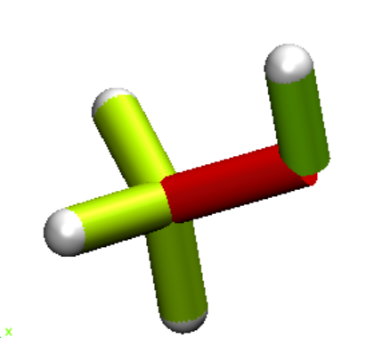

===================================
Reading and interpreting the output
===================================

This is the output of the JEDI Analysis of the example files provided in the 
`Github folder <https://github.com/sannabenter/JEDI/tree/main/test_files>`_. To do the test calculation, 
please take a closer look into the `Examples Section <https://jedi-analysis.readthedocs.io/en/latest/examples/testing>`_.

Raw output
----------

..code-block:: 

    Preparing the JEDI analysis... 

    Starting jedi_rims.py to calculate redundant internal modes from cartesian coordinates.
    Starting jedi_kill_atoms.py to check if atoms specified, that should be ignored in JEDI-Calculation.
        INFO: No user input in jedi_kill_atoms_input.txt, so no atoms are ignored in JEDI-Calculation.
    Starting b_mat.py to calculate the B-Matrix.
    Starting delta_q.py to calculate q0, qF and delta_q.

    
                     JEDI ANALYSIS                
           Judgement of Energy DIstribution       

                    Strain Energy (h)  Deviation (%)
        Geometries      0.01464175           -
    Red. Int. Modes      0.01274058        -12.98

    RIM No.    RIM type             Percentage    Energy (h)
        1       BL 2 1                 16.0        0.0020347
        2       BL 3 1                 15.9        0.0020255
        3       BL 4 1                 15.0        0.0019052
        4       BL 5 1                 41.5        0.0052871
        5       BL 6 5                 12.1        0.0015433
        6       BA 2 1 3               -0.0       -0.0000037
        7       BA 2 1 4                0.0        0.0000062
        8       BA 2 1 5               -0.0       -0.0000045
        9       BA 3 1 4               -0.0       -0.0000023
        10       BA 3 1 5               -0.0       -0.0000032
        11       BA 4 1 5                0.1        0.0000133
        12       BA 1 5 6               -0.5       -0.0000645
        13       DA 6 5 1 2              0.0        0.0000012
        14       DA 6 5 1 3              0.0        0.0000034
        15       DA 6 5 1 4             -0.0       -0.0000010

    Creating tcl scripts for generating color-coded structures in VMD...

    Processing bond lengths...
    Maximum energy in a bond length:       41.50%
    Total energy in the bond lengths:     100.43

    Processing bond angles...
    Maximum energy in a bond angle:         0.10%
    Total energy in the bond angles:       -0.46

    Processing dihedral angles...
    Maximum energy in a dihedral angle:     0.03%
    Total energy in the dihedral angles:    0.03

    JEDI terminated successfully.

    "No reward is worth this." (Han Solo)

The raw output shows both the strain energies of the ab initio calculations and the JEDI Analysis. The deviation can be
interpreted as error of the harmonic approximation. This print out is followed by the percentages of the strain 
in each redundant internal mode. Lastly, the isolated strains are added up in each class of redundant internal modes 
(bond lengths, bond angles and torsion angles).

VMD Analysis
------------

To visualize the strain distribution an output is generated, that is readable in a 
`VMD Analysis <https://www.ks.uiuc.edu/Research/vmd/>`_. The VMD Analysis a tool that
can be used to color code the bonds. JEDI uses a user defined Python routine, that calculates 
the strain in each bond and color codes it according to the strain. For this purpose, 
tcl scripts for use in VMD will be generated automatically ("vmd_bl.tcl" for the bond lengths, "vmd_ba.tcl" for
the bond angles, "vmd_da.tcl" for the dihedral angles and "vmd_all.tcl" for the total distribution).

In the given example a VMD Output of all strain contributions in all modes would look something like this:

The dark red O-C-bond indicates the highest strain in this molecule area. A similar VMD readable output
is generated for the indivual modes (bond lengths, angles and torsions).